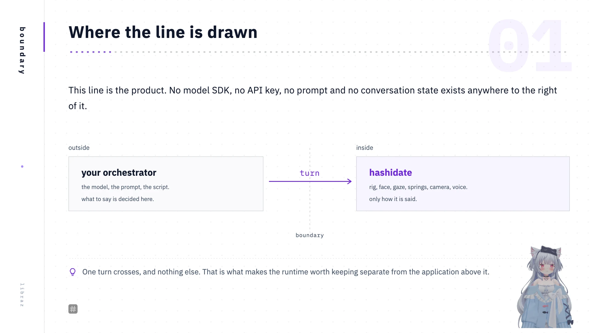

# hashidate

An avatar runtime for an AI VTuber: a browser-rendered character driven over a local HTTP API, one turn of dialogue at a time. The renderer holds the character; the caller holds the script.

[](https://github.com/libraz/hashidate/actions)
[](https://codecov.io/gh/libraz/hashidate)
[](LICENSE)
[](https://www.typescriptlang.org/)
[](https://nodejs.org/)
[](https://threejs.org/)
[](https://react.dev/)
[](docs/en/mcp.md)
[](docs/en/introduction.md)


The broadcast panel with a script loaded on the queue: one line on air, nineteen pending, each carrying a performance. The panel drives the same control API an orchestrator uses.

## No model dependency

hashidate is an adapter, not an application. There is no provider SDK in the dependency tree, no API key to configure, and no persona, prompt, script or conversation state — all of that stays on the caller's side. What crosses the boundary is one turn: some words, optionally a performance to say them with, optionally the shot to say them in.


Swapping the model, the provider or the framework changes nothing on the runtime side. The same runtime is driven from an LLM loop in any language, from an MCP client, from a shell script with no model in it, or by an operator at the broadcast panel, and all four can be mixed in one broadcast.

## Use cases

| Use case | What it does | The interface used |
|---|---|---|
| **An AI VTuber answering chat** | The caller decides the line; hashidate says and performs it. | `POST /api/command`, or the `speak` MCP tool |
| **Commentary over a game** | The character is drawn with a transparent background and OBS composites it over the game capture. | `?transparent=1&place=bottom-right:0.32x0.6` |
| **A talk given from slides** | A PDF behind the character, with page turns carried on the lines. The deck is also readable as text, so a model can write the script for it. | `deck`, `say --slide 2` |
| **A scripted segment** | No model involved. A shell script is enough of an orchestrator. | `yarn ctl say …` |
| **A segment recorded to a file** | Load a script, frame the shot against a queue that is already being synthesised, then record. The mp4 is written to `show/recordings/`. | The panel's Queue and Recording tabs |
| **A broadcast with background music** | MP3 or FLAC from a local show directory, with its own level and libsonare effects. | The panel's BGM tab, or the `bgm` MCP tool |
| **A broadcast run by hand** | The panel is a full operating surface, and everything it does goes through the same API. | `/panel/` |
| **Checking a rigged model** | What the avatar can be asked for is discovered from its own shapes and meshes. | `yarn ctl vocab` |



The third use case, on air. The deck is a PDF the server reads off disk, the character is placed in a corner of the same frame, and page turns arrive on the lines. OBS receives one browser source and composites nothing.

Worked versions of all eight: [Use cases](docs/en/use-cases.md).

## Requirements

A clone of this repository is the runtime and nothing else. Two of its requirements are deliberately not included.

| Requirement | Notes |
|---|---|
| Node 22 and Yarn 4 | Pinned in `mise.toml`. `mise install` installs both. |
| **An avatar** | Required, and **not included.** The descriptors in `src/avatars` point at `public/models/<id>.glb`, which is git-ignored, so a fresh clone has nothing to draw. The two models this runtime was built against are purchased and cannot be redistributed here. Supply your own model, put it through `make glb`, and add one descriptor file. |
| **A voice** | Not required to run, but needed for anything broadcast. Requires `uv` and Python 3.11, and pulls in several GB of PyTorch. The recordings the voice is cloned from are of a real person and are **not included** either. |
| Blender, OBS | Only to convert a model, and only to put the result on a stream. |

Setting up the voice means putting a minute or two of WAV clips in `tools/tts/reference/clips/`, which ships empty for the purpose, and running `make voice` once. Without a voice everything still runs: the line is mouthed silently on the timing the text implies. That path is for tests and development rather than for broadcast.

The voice is swappable for the same reason the model is. A substitute sidecar accepts `{ "text": string }` at `POST /speak`, returns `audio/*`, and answers `GET /health` with a JSON boolean `ready`. See [Speech](docs/en/speech.md).

Full setup and a first run: [Getting started](docs/en/getting-started.md).

## Quick start

```sh
mise install
yarn install
make dev
```

The viewer comes up on `127.0.0.1:5173`, the control API on `127.0.0.1:8765` and the speech sidecar — if its environment has been built — on a socket at `tools/tts/.run/speech.sock`. `yarn dev` starts the first two alone, and `yarn shell` opens the panel and the stage as native windows with all three underneath.

Drive it from another terminal:

```sh
yarn ctl vocab                                  # what this avatar can be asked to do
yarn ctl perform happy                          # a face and a movement, named together
yarn ctl say "Good evening." --perform hello --wait
yarn ctl say "[hello]Good evening. [explain]Tonight I want to talk about this."
yarn ctl bgm list && yarn ctl bgm play opening.mp3
yarn ctl idle on                                # the idle autopilot; breath and gaze run regardless
yarn ctl watch                                  # follow the turn events
```

## Architecture


Three processes and a page. A caller posts commands to the control server; the server streams them to the renderer over SSE and the renderer reports back. OBS points at the renderer's page. Everything binds to `127.0.0.1`. See [Architecture](docs/en/architecture.md).

## Documentation

Start here: [Introduction](docs/en/introduction.md), [Use cases](docs/en/use-cases.md), [Getting started](docs/en/getting-started.md).

Driving it: [The control API](docs/en/control-api.md), [Commands](docs/en/commands.md), [Performances](docs/en/performances.md), [Lines and cues](docs/en/lines-and-cues.md), [Scripts](docs/en/scripts.md), [The MCP adapter](docs/en/mcp.md).

The picture and the sound: [Speech](docs/en/speech.md), [Background music](docs/en/bgm.md), [The stage](docs/en/stage.md), [Slides](docs/en/slides.md), [Motions](docs/en/motions.md), [Recording](docs/en/recording.md), [The surfaces](docs/en/surfaces.md), [The native shell](docs/en/shell.md).

Under it: [Architecture](docs/en/architecture.md), [Avatars](docs/en/avatars.md).

## Non-goals

hashidate renders and animates a character; it is not the VTuber. It has no language model, no speech recognition and no stream output, and the orchestrator that decides what to say lives outside this repository. Speech synthesis is the one exception, and it is confined to `tools/tts/`: a sidecar reached over HTTP and never imported.

The runtime is loopback-only. There is no `--host` flag, no CORS header and no tunnel, because the avatars used for validation may not be republished; exposing the renderer would be a licensing decision before a code change.

Model data does not leave that loop. The browser reads it from `127.0.0.1` and draws it; nothing in the runtime copies it, uploads it or trains on it.

The engine is a runtime, not an editor. Rigging, weighting and garment authoring happen in Blender, and `tools/blender` is the interface between the two.

## Development

```sh
yarn typecheck
yarn lint          # biome
yarn test          # vitest
```

Tests build a synthetic avatar in code rather than loading a GLB, because a suite that needs a purchased 16 MB model can only run on a machine that has bought it.

The constants in `src/engine` were arrived at by watching two real avatars, and most carry a comment naming the failure they prevent. Changing one requires checking the result in a render.

## License

[Apache-2.0](LICENSE) — the code in this repository.

Nothing under `public/models/` is covered by it. The avatars are purchased commercial models under their authors' own terms: a checkout provides the runtime, not the characters it was built against.

The wall and floor textures in `public/textures/` are CC0 1.0, from ambientCG (`WoodFloor001`, `Fabric019`).
