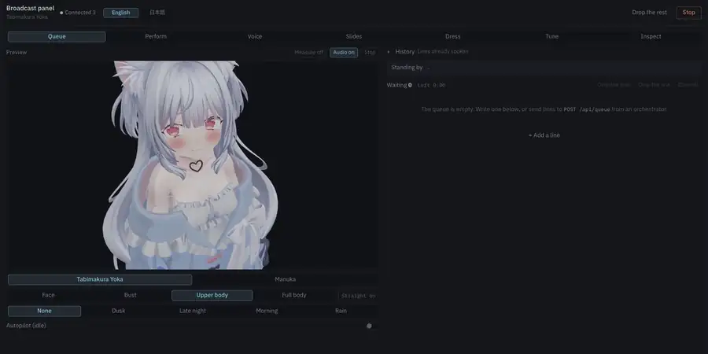
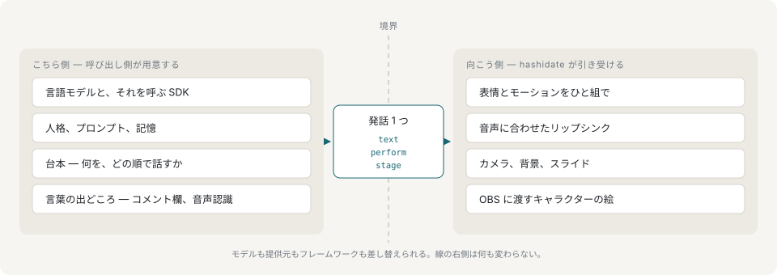
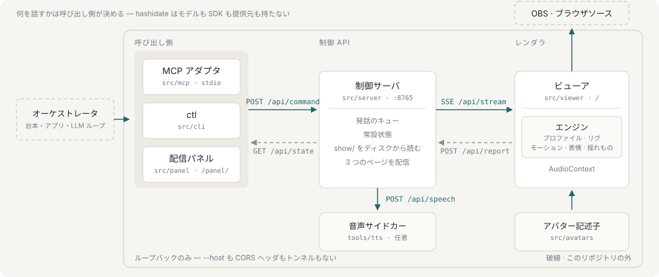

# hashidate

AITuber のためのアバターランタイムです。ブラウザで描いたキャラクターを、ローカルの HTTP API 越しに、1 発話ずつ外から動かします。キャラクターを持つのがレンダラ、台本を持つのが呼び出し側です。

[](LICENSE)
[](https://www.typescriptlang.org/)
[](https://nodejs.org/)
[](https://threejs.org/)
[](https://react.dev/)
[](docs/ja/mcp.md)
[](docs/ja/introduction.md)



キューに積んだ 3 行を、それぞれ演目を付けて順に話しています。右側のパネルが叩いているのは、オーケストレータが使うのと同じ制御 API です。

## どのモデルにも依存しません

hashidate はアプリケーションではなくアダプタです。依存関係に提供元の SDK は入っていませんし、設定する API キーもありません。人格もプロンプトも台本も会話の状態も持ちません。どれも線のこちら側、呼び出し側のものです。線を越えて届くのは発話 1 つ——台詞と、それを何で言うか（プリセット）と、どのショットで言うか（ステージ）——だけで、それを受け取ってキャラクターが喋り、演じます。



モデルも提供元もフレームワークも差し替えられます。線の右側は何も変わりません。同じランタイムを、任意の言語で書いた LLM のループからも、MCP クライアントからも、モデルを一切使わないシェルスクリプトからも、配信パネルの前にいる人からも動かせますし、1 回の配信の中で混ぜて使えます。

## 何が作れるか

| 用途 | 何をするか | 触る場所 |
|---|---|---|
| **コメントに答える AITuber** | 何を言うかは呼び出し側が決め、hashidate がそれを喋って演じます。 | `POST /api/command`、または MCP の `speak` |
| **ゲーム画面の上での実況** | 背景を置かずにキャプチャの上へ。合成は OBS の仕事です。 | `?transparent=1&place=bottom-right:0.32x0.6` |
| **スライドを使った説明** | 後ろに PDF を出し、ページ送りを行に載せます。スライドはテキストとして読めるので、モデルがその台本を書けます。 | `deck`、`say --slide 2` |
| **台本どおりの進行** | モデルはどこにも要りません。シェルスクリプトも立派なオーケストレータです。 | `yarn ctl say …` |
| **一本撮って動画にする** | 台本を読み込み、合成が進んでいるキューを抱えたまま画角を決め、録画を押します。mp4 が `show/recordings/` に落ちます。 | パネルの録画タブ |
| **手で回す配信** | パネルが操作面の全部で、その操作はすべて同じ API を通ります。 | `/panel/` |
| **組んだモデルの確認** | そのアバターに何を頼めるかは、モデル自身のシェイプとメッシュから発見します。 | `yarn ctl vocab` |

7 つとも実際のコマンド付きで：[使いどころ](docs/ja/use-cases.md)。

## 動かすのに必要なもの

クローンして手に入るのはランタイムだけです。必要なもののうち 2 つは、意図的に同梱していません。

| 必要なもの | 補足 |
|---|---|
| Node 22 と Yarn 4 | `mise.toml` で固定してあります。`mise install` で両方入ります。 |
| **アバター** | 必須で、**同梱していません**。`src/avatars` の記述子が指す `public/models/<id>.glb` は git 管理外なので、クローンしただけでは描くものがありません。相手にしてきた 2 体は市販モデルで再配布できないため、モデルはご自身で用意し、`make glb` に通して、記述子を 1 ファイル足してください。 |
| **声** | 起動には要りませんが、実質は必須です。音の出ない VTuber はテスト用の置物です。`uv` と Python 3.11 が要り、PyTorch だけで数 GB あります。声を複製する元の録音も実在する人物のもので、**同梱していません**。手元のクリップを使ってください。 |
| Blender、OBS | モデルを変換するときと、結果を配信に乗せるときだけ。 |

声の用意は、1〜2 分ぶんの WAV を `tools/tts/reference/clips/`（そのために空で同梱してあります）に置いて、コマンドを 1 つ走らせるだけです。

```sh
make voice
```

Python 環境が無ければ作り、クリップを検査し、サイドカーが起動時に読む形へ変換します。

声が無くても全部動きます。テキストから組み立てた尺で、無音のまま口だけが動きます。テストが走っているのもこの状態です。動くと知っておく価値はありますが、配信に出したい状態ではありません。

声を差し替えられるのは、モデルを差し替えられるのと同じ理由です。レンダラは自分のオリジンに音声を求め、サーバが UNIX ソケットへ中継するので、`POST /speak` に `{ text, reading? }` を受けて WAV を返し `GET /health` に答えるものなら何でも代わりになります。向き先は `HASHIDATE_TTS_SOCKET` で動かせますし、ポートで話す代役なら `HASHIDATE_TTS_PORT` で指せます。[音声](docs/ja/speech.md)を参照してください。

詳細と初回の流れ：[はじめかた](docs/ja/getting-started.md)。

## クイックスタート

```sh
mise install
yarn install
make dev
```

ビューアが `127.0.0.1:5173`、制御 API が `127.0.0.1:8765`、音声サイドカーは環境が作ってあれば `tools/tts/.run/speech.sock` のソケットに立ちます。`yarn dev` なら前の 2 つだけです。

別のターミナルから動かします。

```sh
yarn ctl vocab                                  # このアバターに何を頼めるか
yarn ctl perform happy                          # 表情とモーションをひと組にしたもの
yarn ctl say "こんばんは" --perform hello --wait
yarn ctl say "[hello]こんばんは。[explain]今日はこの話をします。"
yarn ctl idle on
yarn ctl watch                                  # 発話のイベントを追う
```

## 全体の形



プロセスが 3 つとページが 1 つです。呼び出し側が制御サーバにコマンドを投げ、サーバが SSE でレンダラへ流し、レンダラが結果を報告します。OBS はレンダラのページを写します。すべて `127.0.0.1` に bind します。[構成](docs/ja/architecture.md)を参照してください。

## ドキュメント

まずここから：[はじめに](docs/ja/introduction.md)、[使いどころ](docs/ja/use-cases.md)、[はじめかた](docs/ja/getting-started.md)。

動かす：[制御 API](docs/ja/control-api.md)、[コマンド](docs/ja/commands.md)、[プリセット](docs/ja/performances.md)、[原稿と演出](docs/ja/lines-and-cues.md)、[台本](docs/ja/scripts.md)、[MCP アダプタ](docs/ja/mcp.md)。

絵と音：[音声](docs/ja/speech.md)、[ステージ](docs/ja/stage.md)、[スライド](docs/ja/slides.md)、[モーション](docs/ja/motions.md)、[録画](docs/ja/recording.md)、[操作面](docs/ja/surfaces.md)。

その下：[構成](docs/ja/architecture.md)、[アバター](docs/ja/avatars.md)。

## やらないこと

hashidate はキャラクターを描いて動かすもので、AITuber そのものではありません。言語モデルも音声認識も配信の出力も持ちませんし、何を喋るかを決めるオーケストレータはこのリポジトリの外にいます。

一線を越えたのは音声合成だけで、それも `tools/tts/` の範囲に留めてあります。HTTP 越しに呼ぶだけで import はしないサイドカーです。エンジン自体も音声のコードを持たず、「喋られた台詞とは何か」を型で述べるだけで、`AudioContext` を持つビューアがそれを実装します。

ループバック限定であることも意図的です。`--host` フラグも CORS ヘッダもトンネルもありません。検証に使っているアバターは再配布が許されておらず、レンダラを外に出すのはコードの変更である前にライセンスの判断だからです。

モデルのデータもそのループから出ません。ブラウザが `127.0.0.1` から読んで描くだけで、それを複製・送信したり学習に使ったりする箇所はランタイムのどこにもありません。

エンジンはランタイムであってエディタではありません。リギング・ウェイト・衣装の作成は Blender の仕事で、`tools/blender` がその境目です。

## 開発

```sh
yarn typecheck
yarn lint          # biome
yarn test          # vitest
```

テストは GLB を読まず、コード上で合成のアバターを組み立てます。購入した 16 MB のモデルを必要とするテストは、それを買ったマシンでしか走りません。

`src/engine` の数値は、実際のアバター 2 体を見ながら決めたものです。その多くには、何を防ぐために存在するのかを書いたコメントが付いています。整理のついでに丸めてよい既定値ではなく、変えるならレンダリングを見て判断することになります。

## ライセンス

[Apache-2.0](LICENSE)。このリポジトリのコードが対象です。

`public/models/` の中身は含みません。アバターは市販のモデルで、それぞれの作者の定めた条件の下にあります。チェックアウトして手に入るのはランタイムであって、それが相手にしてきたキャラクターではありません。

`public/textures/` の壁と床のテクスチャは ambientCG の CC0 1.0 です（`WoodFloor001`、`Fabric019`）。
