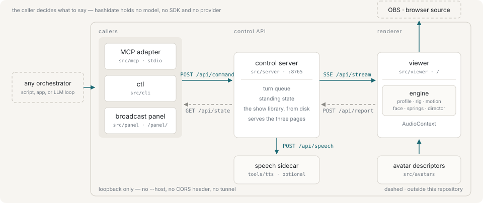

# Architecture

Three processes and a page. A caller posts commands to the control server; the server streams them to the renderer over SSE and the renderer reports back. OBS points at the renderer's page. Everything binds to `127.0.0.1`.

## Repository layout

| Path | What it holds |
|---|---|
| `src/engine` | The runtime. Profile, rig, anatomy, motion, face, secondary motion, director, session. Depends on three.js and on nothing in a browser. |
| `src/avatars` | One descriptor per model. Adding an avatar is adding a file. |
| `src/protocol` | The wire format, as zod schemas. The viewer, the server and the CLI all import it, so the command vocabulary cannot drift between them. |
| `src/viewer` | The renderer: a three.js stage, with a development console beside it. This is the page OBS points at. |
| `src/panel` | The broadcast panel, on `/panel/`. Everything it does goes through the control API, so what it can do is what an orchestrator can do. |
| `src/server` | The local control API. Serves both pages and carries commands to the renderer. |
| `src/control` | The node-side client for that API, shared by `ctl` and the MCP adapter. |
| `src/cli` | `ctl` — a thin client, for driving the avatar by hand. |
| `src/mcp` | The MCP adapter: the same control API, as tools a language model can be handed. |
| `src/script` | Reads a script: a run of turns written out in advance. Invents no vocabulary — a line is a turn, a setup entry is a command. |
| `tools/blender` | The model pipeline. Python, because it runs inside Blender. |
| `tools/tts` | The speech sidecar. Python, because the speech model is a PyTorch codebase. Reached over HTTP, never imported. |
| `show/` | What an operator brings to a broadcast: `slides/`, `scripts/`, `motions/`, `bgm/`. Not tracked and not part of the build; `--slides`, `--scripts`, `--motions` and `--bgm` move those libraries elsewhere. |

## The seams that matter

**The wire vocabulary lives once**, in `src/protocol`, as zod schemas. Adding a command means adding it there first; the viewer, the server and the CLI follow. That is what keeps three processes on separate release cycles from drifting apart.

**The engine does not know it is in a browser.** It depends on three.js and on nothing else — no `AudioContext`, no DOM, no `fetch`. It states what a spoken line is; the viewer, which has the audio, provides one. That is why the test suite can run the whole engine headlessly against a synthetic avatar.

**The server holds the standing state.** The avatar, the costume, the shot, the set, the acoustic, the voice chain, the BGM transport and the tuning are folded into a setup as they are chosen, and handed to a renderer the moment it attaches — along with the pending queue. Nothing about the show lives in the URL a browser source was configured with, and a reload mid-broadcast is survivable. See [The surfaces](surfaces.md).

**The MCP adapter holds no judgement.** Every tool is one of the HTTP endpoints, with the loaded avatar's own ids compiled into the schemas. It is a translation, not a second control plane. See [The MCP adapter](mcp.md).

**The speech sidecar is proxied, not called.** The viewer reaches it through `POST /api/speech` rather than directly, and having one caller is what lets the voice answer on a UNIX socket instead of a port — no page can name a socket, and nothing outside this machine can reach one. That is the same rule the rest of the runtime follows by binding loopback, applied where it can be applied more strictly. Putting the voice back on a port to make a direct call work is a licensing decision before it is a code change.

## Next

- [The control API](control-api.md)
- [Avatars](avatars.md)
- [The surfaces](surfaces.md)
