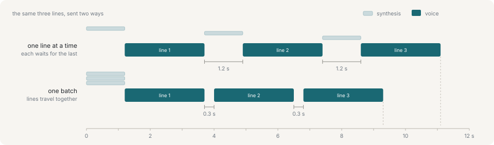

# The control API

An orchestrator — a script, an app, or an LLM loop — posts commands and reads state:

```
POST /api/command   →   the server   →   SSE   →   the renderer
GET  /api/state     ←                ←   POST  ←
```

The unit of work is a **turn**: one line of dialogue delivered with a face and a gesture, followed by the next one. `POST /api/command?wait=1` blocks until the turn ends, so a caller with nothing to do until the character stops talking does not have to poll.

## Send a whole answer at once

`camera`, `room`, `backdrop` and `deck` take effect when they arrive, which suits reacting to something and does not suit describing a line that has not been reached. `say` therefore carries the same axes under `stage`, applied when its turn starts:

```sh
yarn ctl say "This one is the hall." --camera full --room hall
```

That exists to remove silence between lines. A caller that sends one line and waits for it before sending the next pays the whole of the next line's synthesis as a gap, because the renderer asks for a line's audio the moment it is queued and a queue one deep leaves nothing to prepare during.



Measured on the development machine: 1.2 s between every pair of lines when they travel separately, 0.3 s when they travel together. Staging on the line is what lets a run of lines with four different shots be one request.

Put the whole of an answer in one `batch`, and let the shots ride on the lines. Only the first line of each answer pays for being synthesised.

An axis left out of `stage` keeps what it had; `null` empties it — dry for a room, the flat background for a backdrop. On the command line an omitted flag is the first and `--room ''` is the second.

## Endpoints

| Endpoint | What it does |
|---|---|
| `POST /api/command` | One command, or several under `batch` to be delivered together. `?wait=1` returns when the last queued turn ends. |
| `GET /api/state` | Connection, the current state, and the event tail since `?since=`. |
| `GET /api/events` | The event tail alone. `?wait=1` long-polls it. |
| `GET /api/queue` | The pending turns in order. The server owns this list; a turn being said is not included. |
| `GET /api/history` | The bounded history of turns that finished or were interrupted, oldest first. |
| `POST /api/queue` | Add one `turn` or a `turns` batch. `at` chooses `push` or `unshift`; the default is `push`. |
| `POST /api/queue/push` | Add one `turn` or a `turns` batch at the end of the pending list. |
| `POST /api/queue/unshift` | Add one `turn` or a `turns` batch at the front of the pending list. |
| `POST /api/queue/update` | Update the pending turn named by `id`, keeping its queue position and id. |
| `POST /api/queue/remove` | Remove the pending turn named by `id`. |
| `POST /api/queue/move` | Move the pending turn named by `id` to the numeric `to` position. |
| `POST /api/queue/shift` | Remove and return the first pending turn. |
| `POST /api/queue/pop` | Remove and return the last pending turn. |
| `POST /api/queue/clear` | Remove all pending turns. |
| `POST /api/queue/rewind` | Copy a history turn, or that turn and everything after it, back to the front with new ids. `mode` is `one` or `from`; `interrupt` controls the line on air. |
| `GET /api/vocabulary` | What the loaded avatar can be asked for. |
| `GET /api/decks` | The documents on disk, with their page counts. Re-read rather than cached, so a file added while the stream is running appears. |
| `GET /api/decks/<id>/text` | What a document says, page by page, `?from=` and `?to=`. Extracted without drawing anything. |
| `GET /slides/<id>.pdf` | The bytes, for the renderer. Not under `/api/` because it is file serving rather than an API call. |
| `GET /api/motions` | The gestures written into `show/motions/`, parsed and checked, with any file that would not parse listed beside them. Read by the renderer when it connects. |
| `GET /api/bgm` | The MP3 and FLAC files directly under the configured BGM directory. Re-scanned on every request. |
| `GET /bgm/<id>` | One BGM file for a renderer, with byte-range requests. `HEAD` is accepted too. |
| `GET /api/scripts` | The scripts in `show/scripts/`, summarised — title, how many lines, when it was saved — with any file that would not parse listed beside them. Re-read rather than cached, because a script is edited in a text editor beside the panel. |
| `POST /api/scripts/run` | Clear, setup, queue: the three steps a script needs, done here because the panel cannot read a file. Holds the queue by default; `pause: false` runs it live. |
| `POST /api/record/start` | Open a take and tell the renderers to roll. `release: true` releases a held queue once bytes are actually being written. |
| `POST /api/record/stop` | End it. The file stays open for a moment afterwards while the encoder flushes what it is holding. |
| `POST /api/record/chunk` | The renderer's encoded video, a second at a time. Not for callers, and the one route here whose body is not JSON. |
| `GET /api/stream` | The viewer's SSE down-channel. |
| `POST /api/report` | The viewer's up-channel, and its heartbeat. Not for callers. |
| `POST /api/speech` | The viewer's route to the speech sidecar. Not for callers. 503 when there is no sidecar, which is a normal answer. |

Unknown command elements in a mixed `batch` are dropped while known elements are still delivered. If no element is known, the request returns `400` (`no command`). Unknown fields are stripped from ordinary command schemas. `tune` is strict at its command and group boundaries, so a misspelled group or field fails instead of becoming a successful no-op. The orchestrator and the renderer are separate processes with separate release cycles, so a newer caller talking to an older renderer degrades without breaking the stream.

## What comes back

`GET /api/vocabulary` returns what the loaded avatar can be asked for. It is discovered rather than declared — the expression list comes from the model's own shape groups and the wardrobe from its meshes — so it changes when the avatar does. That object is the one to paste into a system prompt, and the cue syntax is stated in it so that a caller is told about it.

`GET /api/state` is everything worth branching on, and cheap enough to poll: `speaking`, the turn id, the queue depth, the emotion vector, the drawn expression and the raised effects, the performance and gesture that are up, and `strain` — what the last fingertip solve cost each arm.

Pointing is deliberately **not** bounded to the range the vocabulary advertises. Those bounds are anatomical, and reaching past them is a supported outcome rather than an error: the arm goes as far as it can, and the strain figure is the only way a caller can tell an aim that was met from one the arm could only approximate.

Beside the state it carries three things the renderer reports about *itself* rather than about the performance:

- `voice` — the chain and the loudness of the last take.
- `tuning` — what the set-once layer is actually running, so a remote fader can be drawn at the value in force rather than at the last one sent.
- `avatars` — which characters this renderer can load. Not the same question as what the loaded one can do.

And four the *server* owns rather than any renderer, because they concern files it has open, the list it holds, and standing state it coordinates:

- `recording` — the take being written, with how many bytes have landed on disk. Null when there is none. It is the server's own figure because a recorder that has quietly stopped and one that is still going look identical from the page doing the recording.
- `airing` — the turns a renderer has started and not yet ended, with their text. `state.turn` says which line is being said and this says what it says: a started line is out of `queue` by then and does not reach the history until it is over. Only lines that went through the queue are here — a `say` posted straight to `/api/command` never enters it.
- `paused` — whether the queue is held. See [Recording](recording.md).
- `bgm` — the selected track, transport and position, level, loop, fade settings and resolved BGM-only DSP values. It also folds in playback errors and a dry-effect fallback reported by audible renderers.

## Next

- [Commands](commands.md) — the full table
- [Recording](recording.md) — what the recording routes are for
- [Background music](bgm.md) — the library and its server-owned transport
- [Performances](performances.md) — what a turn is usually delivered with
- [The MCP adapter](mcp.md) — the same API, as tools
