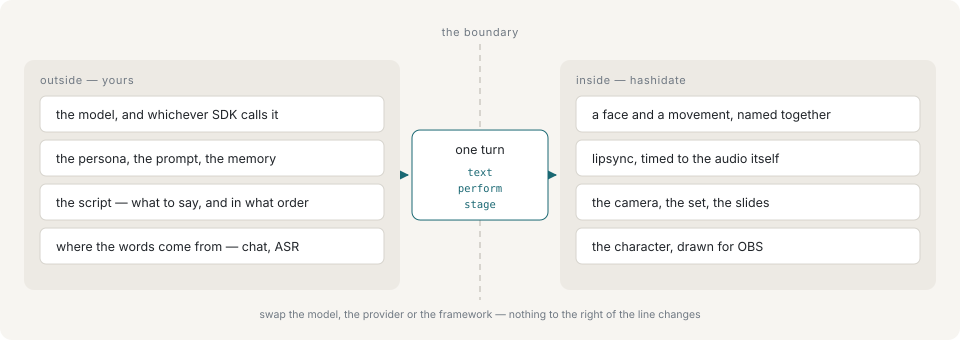

# Introduction

hashidate is an avatar runtime for an AI VTuber: a browser-rendered character that something else drives over a local HTTP API, one turn of dialogue at a time. The renderer holds the character; the caller holds the script.

It is an adapter, not an application. It knows nothing about language models, and it depends on none: there is no provider SDK in the dependency tree, no API key to configure, and no persona, prompt, script or conversation state — all of that stays on the caller's side. What arrives is a turn — some words, optionally a performance to deliver them with, optionally the shot to deliver them in — and what happens is that a character says and performs it.

## Why the line is drawn there

Everything to the left of that line moves fast and belongs to whoever is building the character: which model, what persona and prompt, what it remembers, what the script says and in what order, and whether the words come from a chat window, from speech recognition, or from a file. Everything to the right is a rendering problem that does not change when any of that changes — where the eyes go, how long the mouth stays open, when the hair catches up with the head.

Keeping the two apart means a model swap is not a code change here, and a renderer change is not a rewrite of the orchestrator. Concretely, hashidate is usable from:

- an LLM loop in any language, talking to `POST /api/command`
- an MCP client, with the same API exposed as eight tools
- a shell script with no model in it at all
- the broadcast panel, driven by a person

All four go down the same path and can be mixed in one broadcast.

## What crosses

One turn, and it is a small object:

| Field | What it is |
|---|---|
| `text` | What to say. Performance cues may be written into it in brackets. |
| `perform` | A named face and movement, or the parts spelled out. Optional. |
| `stage` | The camera, the set, the acoustic and the document for this line. Optional. |
| `reading` | Kana pronunciation, where the writing does not determine it. Optional. |

Nothing in it names a model, a voice or an avatar. The same turn plays on a different character, in a different room, with a different voice, without being rewritten.

## What is on the far side

- **Profile discovery** — bones, finger families, visemes, blink shapes and drawn-expression groups resolved from whatever the model actually ships, with ARKit detected rather than assumed.
- **Performances** — a face and a movement named together, grouped by what kind of thing they are, entered and left as a state. One table, spoken by the control API, the panel and the idle autopilot alike.
- **Motion** — gaze with saccades and a sprung head, breathing and weight-shift idles, a gesture table, hop runs, and an arm solved back from where the fingertip has to be, with the joint strain reported. Keyframe motions load off disk beside the built-in table without joining it.
- **Face** — an emotion blend composed onto either ARKit or the model's own shapes, drawn expressions, layered effects, a blink scheduler with an eyelid droop, and text-timed lipsync.
- **Secondary motion** — spring chains for hair and garments, with colliders and a tail.
- **Wardrobe** — slots, presets and the hide-shapes that go with them, read from the model's meshes.
- **Sets and acoustics** — four generated rooms to be seen in and four to be heard in, on separate axes.
- **Slides** — a PDF behind the character, at the frame's own resolution, readable as text by whatever is writing the script.
- **Sound around the voice** — background music from the show directory, on its own level and its own effects, under one audio graph the page owns.
- **Recording** — a take written to a file by the renderer that is on air, with no compositor in the way.

## The engine holds no avatar data

Everything that is a property of one particular model — what its author named things, how its garments are built, how far its eyes turn, which of its shapes are drawn artwork rather than muscle-level parts — lives in a descriptor, and the runtime reads it through a profile. Swapping the avatar swaps that object and nothing else.

That is the claim this repository exists to test: two models by different authors, one of which implements the ARKit 52 blendshape set and one of which implements none of it, driven by the same engine over the same command vocabulary. See [Avatars](avatars.md).

## What it is not

hashidate renders and animates a character; it is not the VTuber. It has no language model, no speech recognition and no stream output, and the orchestrator that decides what to say lives outside this repository.

Speech is the one thing that crossed the line, and only as far as `tools/tts/`: a sidecar that turns a line into audio, reached over HTTP and never imported. Without it the whole thing still runs, with the mouth timed from the text. See [Speech](speech.md).

It is also deliberately loopback-only. There is no `--host` flag, no CORS header and no tunnel, because the avatars used for validation may not be republished: exposing the renderer would be a licensing decision before it was a code change.

The engine is a runtime, not an editor. Rigging, weighting and garment authoring happen in Blender, and `tools/blender` is the seam between the two.

## Next

- [Use cases](use-cases.md) — what people actually build with it
- [Getting started](getting-started.md) — running it
- [Architecture](architecture.md) — how the pieces fit together
