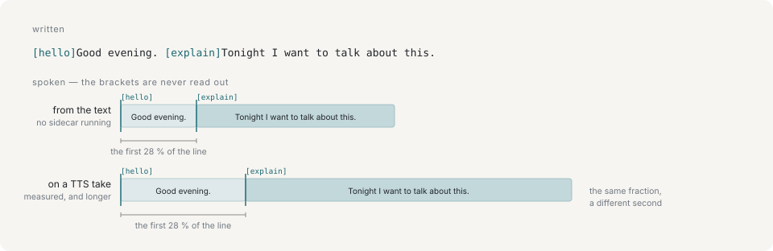

# Lines and cues

A performance usually applies to a whole turn. When it has to change *inside* one, it is written into the line:

```
[hello]Good evening. [explain]Tonight I want to talk about this.
```



A bracketed performance id starts that performance where it is written, and there is no other way to place one mid-sentence: a second turn would put a gap and a breath in the middle of a clause, and a separate `perform` command cannot know when the first half has been said — only the renderer knows how long that takes.

## Brackets are reserved, and nothing inside them is ever spoken

That is the reason the syntax exists in this shape rather than a detail of it. The caller is a language model, everything it writes goes to the mouth, and a character reading a stage direction out loud is the failure the design is arranged around.

So it is guaranteed twice. A line whose markup does not parse fails the schema and the command is dropped, which keeps the character quiet and tells the caller. The parser behind that is total, so a line arriving by any other route comes out with its markup removed rather than read. There is no flag that turns parsing off, and no second field a line can arrive on.

## A cue's position is a fraction, not a time

It rides the mouth's own clock, so it stays where it was written when the line turns out longer than the estimate: a supplied `reading` is a different length, and TTS audio is a different length again. Both rows in the figure above put `[explain]` at the same 35 % of the utterance and therefore at a different second.

An id the performance table does not have is dropped — mid-sentence, a typo should do nothing rather than take the character's face away.

## Reading

Where the writing does not determine the pronunciation, `reading` carries the kana. The example is Japanese because the field exists for Japanese: the same characters are read more than one way, and only the writer knows which.

```sh
yarn ctl say "紅い月" --reading "あかいつき"
```

`reading` carries no cues of its own. Cues belong to the text, which is the thing being performed; the reading is only how it sounds.

## Next

- [Performances](performances.md) — the table the ids come from
- [Speech](speech.md) — what happens to a line on the way to the speakers
