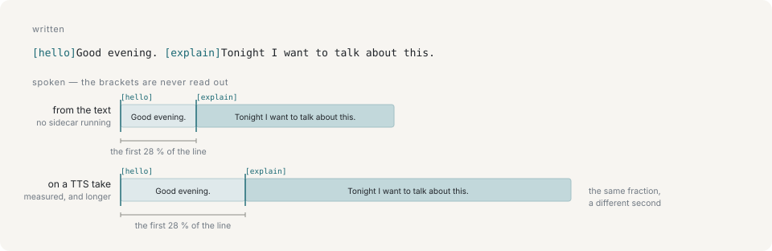

# Lines and cues

A cue changes one part of the broadcast at a position inside one spoken line. The legacy performance shorthand and the typed forms use the same brackets:

```
[hello]Good evening. [@camera bust]Tonight I want to talk about this. [@bgm play]
```



A bracketed cue starts its action where it is written. There is no other way to place one mid-sentence: a second turn would put a gap and a breath in the middle of a clause, and a separate command cannot know when the first half has been said, because only the renderer knows how long that takes.

## Cue forms

`[performanceId]` remains the shorthand for `[@perform performanceId]`. Typed cues make the action explicit:

| Syntax | Action |
|---|---|
| `[@perform id]` | Start a named performance. |
| `[@expression id]` | Set a drawn expression. |
| `[@gesture id]` | Start a body motion. |
| `[@hop id]` | Start a hop. |
| `[@camera face\|bust\|upper\|full]` | Change the camera framing. |
| `[@slide 3]` | Move to an absolute, 1-based document page. |
| `[@bgm play]` | Resume the currently selected BGM track. |
| `[@bgm play track filename]` | Select and play a track. The remainder is the filename, so spaces and Japanese characters are allowed. |
| `[@bgm pause]` | Pause the selected BGM track. |
| `[@bgm stop]` | Stop the selected BGM track and return it to the start. |
| `[@bgm set {JSON}]` | Apply one structured BGM patch at this point in the line. |

Typed cues are part of the ordinary `text` field. They travel through `speak`, `say`, `queue`, and script lines; no extra MCP or CLI operation is needed. The `[` and `]` characters are reserved because they delimit a cue.

For `perform`, `expression`, `gesture`, and `hop`, everything after the cue kind is the id. That lets a loaded motion such as `big wave` be written as `[@gesture big wave]`; spaces and Japanese characters are valid in these dynamic ids.

### Structured BGM patches

`[@bgm set {JSON}]` carries one JSON object with the same input fields as a BGM command. The patch is applied atomically at the cue's mouth position. Omitted fields retain their current values, and changed settings remain in force for later lines. The fixed libsonare chain is reused; a cue does not add a processor or create an interpolation ramp.

| Field | Allowed value |
|---|---|
| `action` | Optional `play`, `pause`, or `stop`. |
| `track` | Optional `.mp3` or `.flac` filename, or `null`. A filename selects that track stopped at the beginning unless `action` is `play`; `null` unloads the track and wins over any action. |
| `volume` | Number from 0 to 1. |
| `loop` | Boolean. |
| `fade.inSeconds`, `fade.outSeconds` | Numbers from 0 to 10. |
| `dsp.toneDb` | Number from −6 to 6 dB. |
| `dsp.compression` | Number from 0 to 1. |
| `dsp.width` | Number from 0 to 2. |
| `dsp.reverb.mix`, `dsp.reverb.decay`, `dsp.reverb.damping` | Numbers from 0 to 0.5, 0 to 0.9, and 0 to 1 respectively. |
| `dsp.pitch.semitones` | Number from −24 to 24 semitones; default 0. The pitch shift preserves tempo and duration. |
| `dsp.pitch.mix` | Number from 0 to 1; default 0 disables the shifter and keeps the original pitch. |
| `dsp.presence.amount` | Number from 0 to 1; default 0 disables presence and generates no nonlinear harmonics from the selected band. |
| `dsp.presence.drive` | Number from 0 to 8; default 2. |
| `dsp.presence.frequencyHz` | Number from 500 to 8000 Hz; default 3200 Hz. |

For example, one cue selects and starts a track with its mix and effects, another changes the mix during the line, and a final cue stops it:

```text
The opening starts here. [@bgm set {"action":"play","track":"opening.mp3","volume":0.16,"fade":{"inSeconds":1.25,"outSeconds":0.75},"dsp":{"toneDb":1,"compression":0.25,"reverb":{"mix":0.08,"decay":0.45},"pitch":{"semitones":7,"mix":0.35},"presence":{"amount":0.25,"drive":3,"frequencyHz":3200}}}]
The music gets louder here. [@bgm set {"volume":0.24,"fade":{"outSeconds":0.5}}]
The segment ends here. [@bgm set {"action":"stop"}]
```

Unknown fields, including unknown nested fields, are rejected. Empty patches at any level are rejected, as are command-envelope and server-stamped fields such as `cmd`, `id`, `revision`, `transport`, `position`, and `at`. Invalid JSON or an out-of-range value rejects the line before it is queued. The square brackets remain reserved delimiters and are not spoken.

A cue carries no `side`, so a movement started mid-sentence draws its hand as it always has. A line that needs a particular hand names the movement in the line's own `gesture` or `perform` and pins it there — see [Which hand](commands.md#which-hand).

Camera, slide, and structured BGM cues act at the point in the line where they occur. `room`, `backdrop`, `deck`, and `place` remain line-start `stage` setup because they describe the state for the line rather than a point inside it. The short BGM transport cues use the current fade settings; use a structured patch when the cue itself must change volume, looping, fade durations, or libsonare DSP. Relative slides are not inline cues; use an absolute page.

## Brackets are reserved

Nothing inside a bracket is ever spoken. The caller is a language model, everything it writes goes to the mouth, and a character reading a stage direction out loud is the failure this syntax is arranged around.

The guarantee is made twice. A line whose markup does not parse fails the schema and the command is dropped, which keeps the character quiet and reports the problem to the caller. The parser behind that is total, so a line arriving by any other route comes out with its markup removed rather than read. There is no flag that turns parsing off, and no second field a line can arrive on.

## Cue position

A cue's position is a fraction of the utterance rather than a time. It rides the mouth's own clock, so it stays where it was written when the line turns out longer than the estimate: a supplied `reading` is a different length, and TTS audio is a different length again. Both rows in the figure above put `[explain]` at the same 35 % of the utterance and therefore at a different second.

A camera, slide or performance cue also updates the standing state, so a renderer that attaches later is handed the shot, page and mood the line left behind.

An id absent from the active avatar's vocabulary does nothing, so a typo mid-sentence leaves the current face or movement alone.

## Reading

Where the writing does not determine the pronunciation, `reading` carries the kana. The example is Japanese because the field exists for Japanese, where the same characters are read more than one way and only the writer knows which.

```sh
yarn ctl say "紅い月" --reading "あかいつき"
```

`reading` carries no cues of its own. Cues belong to the text, which is the thing being performed; the reading is only how it sounds.

## Next

- [Performances](performances.md) — the table the ids come from
- [Speech](speech.md) — what happens to a line on the way to the speakers
