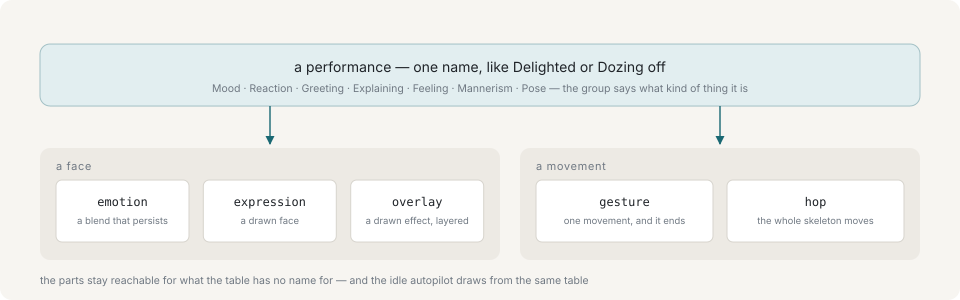

# Performances

A turn is usually *delivered with* a **performance** — a named face and movement together, such as Delighted or Dozing off.



The layers underneath are kept separate because they behave differently: an emotion is a continuous blend that persists, a gesture is discrete and ends, a hop moves the whole skeleton. None of them is the shape a caller thinks in. Asking for Delighted is one call; asking for joy 0.9 with a cheer gesture and three hops of 45 mm is four calls, and states a rig problem rather than a script.

## Groups

Mood (a face and nothing else, which is most of what watching a character looks like), Reaction, Greeting, Explaining, Feeling, Mannerism, and Pose, which is held until something else is asked for.

Every gesture the engine has appears in at least one performance, and a test asserts it: a movement with no face attached is one the autopilot would eventually play deadpan.

## A performance is a state

Starting one ends the last: the pose comes down, a raised effect is lowered, a droop on the eyelids is released.

Its mood is the exception and persists, for the same reason a turn's emotion does — a mood does not end with the sentence that carried it.

## The underlying layers

For what the table has no name for, `emotion`, `expression`, `overlay`, `gesture` and `hop` are all still commands of their own. See [Commands](commands.md).

The idle autopilot draws from the same table, so what the character does on its own and what it can be asked to do are one vocabulary. `idle on` lets the character keep performing between turns without the caller sending anything.

## What runs continuously

Under all of it the character is never still. Breathing, a weight shift from one foot to the other, blinks on a scheduler, gaze with saccades and a head that springs after it, hair and garments catching up a beat late: none of it is a command and none of it waits for a caller.

`idle` sits above that layer rather than switching it on. With `idle` off the character stops *performing* by itself and goes on breathing. Those numbers are reached by `tune`, which is a fader per curve rather than a switch.

## Listing what an avatar has

`GET /api/vocabulary` lists the performances the loaded avatar actually has, grouped. Over MCP the same ids are compiled into the tool schemas, so a model picks from a list rather than inventing one.

```sh
yarn ctl vocab
```

## Next

- [Lines and cues](lines-and-cues.md) — changing performance inside one line
- [Commands](commands.md) — the layers underneath
