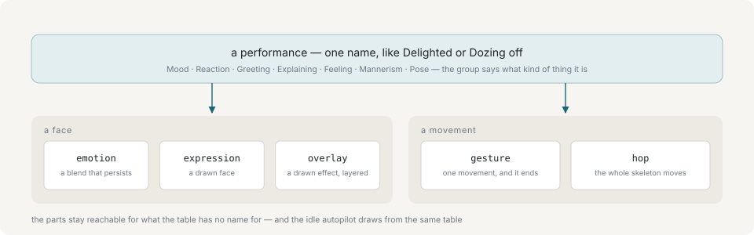

# Performances

A turn is usually *delivered with* a **performance** — a named face and movement together, such as Delighted or Dozing off.



The layers underneath are kept separate because they behave differently: an emotion is a continuous blend that persists, a gesture is discrete and ends, a hop moves the whole skeleton. None of them is the shape a caller thinks in. Asking for Delighted is one call; asking for joy 0.9 with a cheer gesture and three hops of 45 mm is four calls, and states a rig problem rather than a script.

## Groups

The general groups are Mood, Reaction, Greeting, Explaining, Feeling, Mannerism, and Pose. Pose holds its gestures until released. The following groups offer short motions for affectionate reactions, playful exchanges, and camera moments:

| Group | Performance ids |
| --- | --- |
| Affection | `blowKiss`, `heartHands`, `heartOffer`, `selfHug`, `heartFlutter` |
| Playful | `peekaboo`, `bunnyEars`, `fingerWag`, `pawBounce`, `shoulderShimmy` |
| Idol | `doubleWave`, `idolPoint`, `spotlight`, `cuteSalute`, `stageBow` |
| Encouragement | `fistPump`, `doublePump`, `rahRah`, `encourage`, `bravo` |
| Dance | `sideSway`, `shoulderBounce`, `handRoll`, `discoPoint`, `tinyDance` |
| Photo pose | `flowerPose`, `cheekPeace`, `cheekPoints`, `faceFrame`, `modelTilt` |

These motions finish on their own, including Photo pose. Their mood persists until another emotion or performance replaces it. Each id names both a performance with a face and a gesture that plays only the movement.

```sh
yarn ctl perform blowKiss
yarn ctl perform doubleWave
yarn ctl say "Thank you for coming!" --perform flowerPose
```

In the control panel and development console, select a group to show its presets. Search by English or Japanese name, or by id, across all groups. Clearing the search returns to the selected group. The release button remains available when the active preset is in another group.

You can also use the ids in a turn's `perform` field and inline cues such as `[heartHands]`.

Every engine gesture has at least one matching performance, so callers can request any movement together with a mood. Tests check that coverage.

## A performance is a state

Starting one ends the last: the pose comes down, a raised effect is lowered, a droop on the eyelids is released.

Its mood is the exception and persists, for the same reason a turn's emotion does — a mood does not end with the sentence that carried it.

## The underlying layers

For what the table has no name for, `emotion`, `expression`, `overlay`, `gesture` and `hop` are all still commands of their own. See [Commands](commands.md).

The idle autopilot draws from a selected pool in the same table. The six groups above play when selected explicitly; they do not change the idle pool. `idle on` lets the character keep performing between turns without the caller sending anything.

## What runs continuously

Under all of it the character is never still. Breathing, a weight shift from one foot to the other, blinks on a scheduler, gaze with saccades and a head that springs after it, hair and garments catching up a beat late: none of it is a command and none of it waits for a caller.

`idle` sits above that layer rather than switching it on. With `idle` off the character stops *performing* by itself and goes on breathing. Those numbers are reached by `tune`, which is a fader per curve rather than a switch.

## Listing what an avatar has

`GET /api/vocabulary` lists the performances the loaded avatar actually has, grouped. Over MCP the same ids are compiled into the tool schemas, so a model picks from a list rather than inventing one.

```sh
yarn ctl vocab
```

## Next

- [Lines and cues](lines-and-cues.md) — changing performance inside one line
- [Commands](commands.md) — the layers underneath
