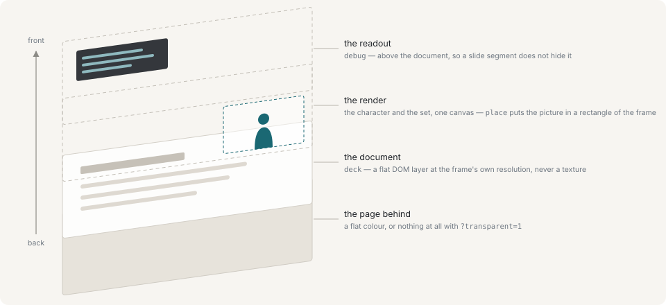

# Slides

A PDF put up behind the character, to present from.


That is one browser source, exactly as OBS receives it: the page fills the frame, the character is placed in a corner of it, and the page turns arrive on the lines.



The page is flat. It is not geometry in the room and not a texture on a screen somewhere in the scene: it is a DOM layer directly behind the render, at the frame's own resolution. What a 3D pipeline would otherwise do to it is what makes slide text unreadable — tone mapping moves the white, filtering softens strokes a pixel wide, and a page turn becomes a texture upload rather than an image swap. Drawing it flat costs the ability to tilt it and keeps type as sharp as the file is.

## Showing a document

Put the documents in `show/slides/`. `--slides <dir>` moves that anywhere, including outside the repository, and either way they are ignored by git. A document's id is its filename without the extension.

One document ships: `hashidate.pdf`, three pages about this runtime and its author, which is what the demo script presents from. It is an exception to the ignore rule for the same reason `demo.yaml` is — it belongs to the project rather than to a broadcast.

```sh
yarn ctl deck intro          # up, at page 1
yarn ctl slide               # next
yarn ctl slide prev
yarn ctl slide 12
yarn ctl deck none           # down
```

While a document is up it takes the place of the set: both go behind the character, and the renderer puts the room away for the duration and brings it back unchanged when the document comes down. They remain two commands, so a segment that goes to slides and back is one command each way and neither has to restate the other.

The character moves out of the way with `place`, which shrinks the picture rather than the shot. See [The stage](stage.md#where-the-character-stands-in-the-frame).

## Page turns on a line

A page turn can ride on a line, which is what makes a document follow a script rather than an operator:

```sh
yarn ctl say "The whole picture first." --slide 2
yarn ctl say "And this is what it looks like." --deck hashidate --slide 1
```

That page is **absolute, and there is deliberately no relative form on a line.** A queued line can be dropped, reordered or sent round again, and a "next page" written into one means a different page every time the script is touched: the rest of the deck slips by one and nothing in the queue records why.

`slide`'s relative form is for the operator with a hand on an arrow key, reacting to what is on screen rather than describing it.

## Fonts

A deck that names a font instead of embedding it — which a Japanese one usually does, because the machine that made it had the font installed — is drawn from the character maps and standard outlines that ship with pdf.js, served out of the installed package at `/pdfjs/`. Without them such a page draws with its text absent, and nothing reports it.

## Reading a document as text

`GET /api/decks/<id>/text` returns the words on the pages, extracted without rasterising anything, and the MCP layer offers the same thing as a tool.

That is what the feature is for: a model that can read the deck can write the script for it and put the page numbers on the lines.

```sh
curl '127.0.0.1:8765/api/decks/intro/text?from=1&to=3'
```

## Next

- [The stage](stage.md) — the set the document displaces
- [The MCP adapter](mcp.md) — reading a deck from a model
