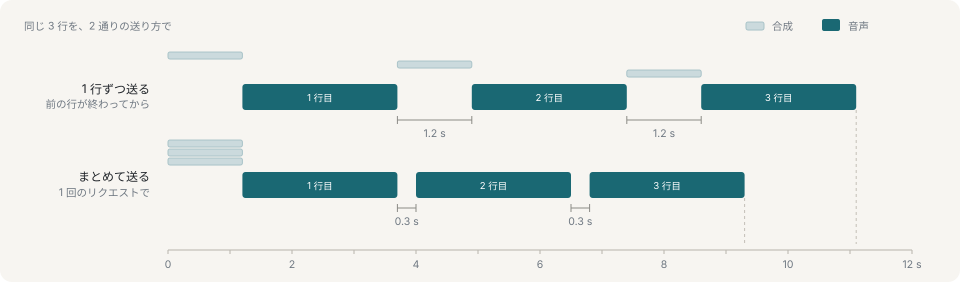

# 制御 API

オーケストレータ——台本でもアプリでも、本番では LLM のループ——がコマンドを投げ、状態を読みます。

```
POST /api/command   →   サーバ   →   SSE    →   レンダラ
GET  /api/state     ←            ←   POST   ←
```

作業の単位は**発話**です。1 行の台詞を、表情とジェスチャを添えて届け、終わったら次へ進みます。`POST /api/command?wait=1` は発話が終わるまで返らないので、キャラクターが喋り終わるまで何もすることのない呼び出し側がポーリングを書かずに済みます。

## まとめて送る

`camera`・`room`・`backdrop`・`deck` は届いた時点で効きます。何かに反応するにはこれが正しく、まだ喋っていない行について記述するには正しくありません。そこで `say` は同じ軸を `stage` として持ち、その発話が始まるときに適用します。

```sh
yarn ctl say "これが、ホール。" --camera full --room hall
```

これがあるのは無音のためです。1 行送って待ってから次を送ると、次の行の合成にかかる時間がまるごと行間になります。レンダラは台詞が積まれた瞬間にその音声を要求するので、キューが 1 つしかないと準備する時間がないからです。



この環境での実測で、別々に送ると行間が 1.2 秒、まとめて送ると 0.3 秒でした。ショットを行に載せられるので、4 つの異なる画角をまたぐ一続きの台詞が 1 リクエストで済みます。

つまり、答え全体を 1 つの `batch` に入れて、ショットは行に載せてください。合成の待ち時間を払うのは、その答えの最初の 1 行だけになります。

`stage` に書かなかった軸は、それまでの値を保ちます。`null` を書くと空になります——部屋なら残響なし、背景なら素の背景です。コマンドラインではフラグを省略するのが前者、`--room ''` が後者です。

## エンドポイント

| エンドポイント | 何をするか |
|---|---|
| `POST /api/command` | コマンド 1 つ、または `batch` に並べてまとめて。`?wait=1` は最後に積んだ発話が終わるまで返りません。 |
| `GET /api/state` | 接続状況・現在の状態・`?since=` 以降のイベント。 |
| `GET /api/events` | イベントだけ。`?wait=1` でロングポーリングになります。 |
| `GET /api/queue` | 待機中の発話を順番どおりに返します。リストの所有者はサーバで、発話中の行は含みません。 |
| `GET /api/history` | 終了または中断した発話の履歴を、古い順に返します。件数には上限があります。 |
| `POST /api/queue` | `turn` 1 つ、または `turns` の配列を追加します。`at` は `push` か `unshift` で、省略時は `push` です。 |
| `POST /api/queue/push` | `turn` 1 つ、または `turns` の配列を待機リストの末尾へ追加します。 |
| `POST /api/queue/unshift` | `turn` 1 つ、または `turns` の配列を待機リストの先頭へ追加します。 |
| `POST /api/queue/update` | `id` で指定した待機中の発話を、その位置と id を保ったまま更新します。 |
| `POST /api/queue/remove` | `id` で指定した待機中の発話を削除します。 |
| `POST /api/queue/move` | `id` で指定した待機中の発話を、数値の `to` 位置へ移動します。 |
| `POST /api/queue/shift` | 待機リストの先頭を削除し、削除した発話を返します。 |
| `POST /api/queue/pop` | 待機リストの末尾を削除し、削除した発話を返します。 |
| `POST /api/queue/clear` | 待機中の発話をすべて削除します。 |
| `POST /api/queue/rewind` | 履歴の発話 1 つ、またはそれ以降の発話を新しい id で先頭へ戻します。`mode` は `one` か `from`、`interrupt` は放送中の行をどうするか指定します。 |
| `GET /api/vocabulary` | 読み込み中のアバターに何を頼めるか。 |
| `GET /api/decks` | ディスク上のスライドと、そのページ数。キャッシュではなく読み直しです。配信中にファイルが増えるからです。 |
| `GET /api/decks/<id>/text` | スライドの中身をページごとに。`?from=` と `?to=` で範囲を切ります。描画は一切していません。 |
| `GET /slides/<id>.pdf` | レンダラが読む実体。ファイルの配信であって API 呼び出しではないので `/api/` の下にはありません。 |
| `GET /api/motions` | `show/motions/` に書かれたジェスチャを、検証済みで。読めなかったファイルもその理由とともに並びます。レンダラが接続時に読みます。 |
| `GET /api/bgm` | 設定済みの BGM ディレクトリ直下にある MP3 と FLAC。リクエストごとに再走査します。 |
| `GET /bgm/<id>` | レンダラへ BGM ファイルを配信します。バイト範囲と `HEAD` に対応します。 |
| `GET /api/scripts` | `show/scripts/` の台本の要約——題、行数、保存時刻。台本になっていないファイルもその理由とともに並びます。キャッシュせず毎回読み直します。台本はパネルの横のエディタで編集されるからです。 |
| `POST /api/scripts/run` | clear・setup・queue の 3 段をここで行います。パネルはファイルを読めないからです。既定ではキューを止めたまま。`pause: false` でそのまま流します。 |
| `POST /api/record/start` | 録画を開き、レンダラに開始を伝えます。`release: true` なら、実際に書き込みが始まった時点で止めてあるキューを解放します。 |
| `POST /api/record/stop` | 終えます。エンコーダが抱えている分を吐き出すあいだ、ファイルはしばらく開いたままです。 |
| `POST /api/record/chunk` | レンダラが送ってくるエンコード済み映像、1 秒ずつ。呼び出し側が使うものではなく、ここで唯一ボディが JSON でないルートです。 |
| `GET /api/stream` | ビューアへの SSE 下り。 |
| `POST /api/report` | ビューアからの上り。ハートビートも兼ねます。呼び出し側が使うものではありません。 |
| `POST /api/speech` | ビューアから音声サイドカーへの経路。呼び出し側が使うものではありません。サイドカーが居なければ 503 で、それは正常な返事です。 |

`batch` に既知と未知のコマンドを混ぜると、未知の要素だけを捨てて既知の要素を送ります。既知の要素が 1 つもなければ `400`（`no command`）です。通常のコマンドでは未知のフィールドを取り除きます。`tune` はコマンドと各グループを厳密に検証するため、グループ名やフィールド名の誤記は何もしない成功にならず失敗します。オーケストレータとレンダラは別プロセスで、リリースの周期も別なので、新しい呼び出し側が古いレンダラに話しかけてもストリームを壊さずに動き続けます。

## 返ってくるもの

`GET /api/vocabulary` は、読み込み中のアバターに何を頼めるかを返します。これは宣言ではなく発見されたものです。表情の一覧はモデル自身のシェイプ群から、衣装はメッシュから引いているので、アバターが変われば中身も変わります。システムプロンプトに貼るのはこのオブジェクトです。原稿の記法もその中に入れてあるのは同じ理由で、伝えていない構文は誰にも使われないからです。

`GET /api/state` は分岐に使う値をひと通り、ポーリングに耐える軽さで返します。発話中かどうか、発話 id、積まれている数、感情ベクトル、出ている描き起こし表情と効果、保持中のプリセットとジェスチャ、そして `strain`——直前の指先解決が各腕にどれだけ無理をさせたかです。

指さしの角度は、語彙が告げる範囲に**あえて**制限していません。あの範囲は解剖学的なもので、それを超えて手を伸ばすのはエラーではなく想定された結果です。腕は届く限りのところまで行きます。人がそうするからで、そして strain の値は、狙いどおりに届いたのか近似しかできなかったのかを呼び出し側が知る唯一の手段です。

状態と並んで、レンダラが「演技」ではなく「自分自身」について報告する値が 3 つあります。

- `voice` — 直前の take の処理内容と音量。
- `tuning` — 調律の層がいま実際に動かしている値。遠隔のフェーダーを、最後に誰かが送った値ではなく、効いている値の位置に描けます。
- `avatars` — このレンダラが読み込めるキャラクターの一覧。いま立っているアバターに何を頼めるか、とは別の問いです。

さらに、どのレンダラでもなく**サーバ自身**が持つ値が 3 つあります。開いているファイルと、サーバが協調させる常設状態についてだからです。

- `recording` — 書き込み中の録画と、ディスクに実際に落ちたバイト数。ないときは null。サーバ自身の数字なのは、黙って止まったレコーダとまだ動いているレコーダが、録画しているページ側からは見分けられないからです。
- `paused` — キューが止まっているかどうか。[録画](recording.md)を参照。
- `bgm` — 選択中のトラック、再生状態と位置、音量、ループ、フェード設定、解決済みの BGM 専用 DSP 値。音を出すレンダラから報告された再生エラーと、エフェクトなしの経路へ退避したことも畳み込みます。

## 次に読むもの

- [コマンド](commands.md) — 一覧
- [録画](recording.md) — 録画系ルートが何のためにあるか
- [BGM](bgm.md) — ライブラリと、サーバが持つ再生状態
- [プリセット](performances.md) — 発話に添えるもの
- [MCP アダプタ](mcp.md) — 同じ API を、ツールとして
