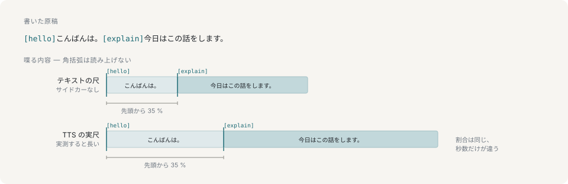

# 原稿と演出

キューは、1 行の発話の途中で放送の一部を変える記法です。従来のプリセット省略記法と型付き記法は同じ角括弧を使います。

```
[hello]こんばんは。[@camera bust]今日はこの話をします。[@bgm play]
```



角括弧に囲んだキューは、書かれた位置で動作を始めます。文の途中に置く方法は他にありません。発話を 2 つに割れば節の真ん中に間と息が入りますし、別のコマンドを投げても前半を言い終わる時刻は分かりません。それを知っているのはレンダラだけです。

## キューの形式

`[performanceId]` は `[@perform performanceId]` の省略記法として残っています。型付きキューでは動作を明示します。

| 形式 | 動作 |
|---|---|
| `[@perform id]` | 名前付きプリセットを始めます。 |
| `[@expression id]` | 描き起こしの表情を設定します。 |
| `[@gesture id]` | 身体のモーションを始めます。 |
| `[@hop id]` | 跳躍を始めます。 |
| `[@camera face\|bust\|upper\|full]` | カメラの画角を変えます。 |
| `[@slide 3]` | 1 始まりの絶対ページへ移動します。 |
| `[@bgm play]` | 現在選択されている BGM を再開します。 |
| `[@bgm play track filename]` | トラックを選択して再生します。末尾全体がファイル名なので、空白と日本語を含められます。 |
| `[@bgm pause]` | 選択中の BGM を一時停止します。 |
| `[@bgm stop]` | 選択中の BGM を停止して先頭へ戻します。 |

型付きキューは通常の `text` フィールドに書きます。`speak`、`say`、`queue`、台本の行を通り、MCP や CLI に専用の操作を追加する必要はありません。`[` と `]` はキューを囲む予約文字です。

`perform`、`expression`、`gesture`、`hop` では、キュー種別より後ろの全体が id です。たとえば `big wave` という読み込み済みモーションは `[@gesture big wave]` と書けます。これらの動的 id には空白と日本語を使えます。

カメラとスライドのキューは、行の中で書かれた位置に到達した時点で動作します。`room`、`backdrop`、`deck`、`place` は、行全体に対する状態なので、行頭の `stage` 設定に残ります。BGM の音量、ループ、libsonare DSP はパネルと MCP のミキサー設定で操作します。相対ページはインラインキューに含まれないため、絶対ページを指定してください。

## 角括弧は予約されていて、中身は読み上げない

これはこの構文の細部ではなく、この形をしている理由そのものです。呼び出し側は言語モデルで、書いたものはすべて口へ行きます。キャラクターがト書きを音読するのが、この設計の避けたい失敗です。

そこで二重に保証しています。解釈できない記法を含む行はスキーマを通らず、コマンドごと捨てられます。キャラクターは黙り、呼び出し側には伝わります。その後ろにいるパーサは全域関数で、別の経路からエンジンに届いた行も、読み上げられるのではなく記法が取り除かれた形で出てきます。解釈を切るフラグはなく、台詞が届きうる 2 つめのフィールドもありません。

## 位置は時刻ではなく割合

演出の位置は発話全体に対する割合で保持し、口自身の時計に乗せています。そのため見積もりより長く喋ることになっても、書かれた場所に留まります。`reading` を添えれば長さは変わりますし、TTS の音声はまた別の長さになるからです。上の図の 2 行はどちらも `[explain]` を全体の 35 % に置いていて、つまり秒数だけが違います。

現在のアバターの語彙にない id は何も実行しません。文の途中で打ち間違えても、その時点の表情や動作を保ちます。

## 読み

表記から読みが決まらないときは、`reading` に仮名を渡します。

```sh
yarn ctl say "紅い月" --reading "あかいつき"
```

`reading` に演出は書けません。演出が属するのは演じられる対象であるテキストのほうで、読みはその音でしかないからです。

## 次に読むもの

- [プリセット](performances.md) — id の出どころ
- [音声](speech.md) — 台詞がスピーカーへ届くまで
