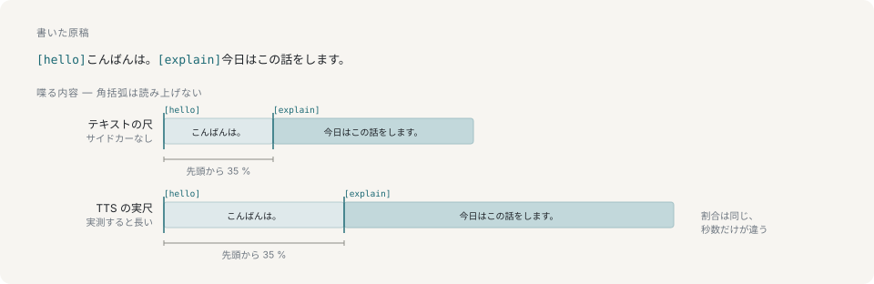

# 原稿と演出

キューは、1 行の発話の途中で放送の一部を変える記法です。従来のプリセット省略記法と型付き記法は同じ角括弧を使います。

```
[hello]こんばんは。[@camera bust]今日はこの話をします。[@bgm play]
```



角括弧に囲んだキューは、書かれた位置で動作を始めます。文の途中に置く方法は他にありません。発話を 2 つに割れば節の真ん中に間と息が入りますし、別のコマンドを投げても前半を言い終わる時刻は分かりません。それを知っているのはレンダラだけだからです。

## キューの形式

`[performanceId]` は `[@perform performanceId]` の省略記法として残っています。型付きキューでは動作を明示します。

| 形式 | 動作 |
|---|---|
| `[@perform id]` | 名前付きプリセットを始めます。 |
| `[@expression id]` | 描き起こしの表情を設定します。 |
| `[@gesture id]` | 身体のモーションを始めます。 |
| `[@hop id]` | 跳躍を始めます。 |
| `[@camera face\|bust\|upper\|full]` | カメラの画角を変えます。 |
| `[@slide 3]` | 1 始まりの絶対ページへ移動します。 |
| `[@bgm play]` | 現在選択されている BGM を再開します。 |
| `[@bgm play track filename]` | トラックを選択して再生します。末尾全体がファイル名なので、空白と日本語を含められます。 |
| `[@bgm pause]` | 選択中の BGM を一時停止します。 |
| `[@bgm stop]` | 選択中の BGM を停止して先頭へ戻します。 |
| `[@bgm set {JSON}]` | 行のその位置で構造化された BGM パッチを 1 つ適用します。 |

型付きキューは通常の `text` フィールドに書きます。`speak`、`say`、`queue`、台本の行を通り、MCP や CLI に専用の操作を追加する必要はありません。`[` と `]` はキューを囲む予約文字です。

`perform`、`expression`、`gesture`、`hop` では、キュー種別より後ろの全体が id です。たとえば `big wave` という読み込み済みモーションは `[@gesture big wave]` と書けます。これらの動的 id には空白と日本語を使えます。

### 構造化された BGM パッチ

`[@bgm set {JSON}]` には、BGM コマンドと同じ入力フィールドを持つ JSON オブジェクトを書きます。パッチはキューの位置で 1 つの操作として適用されます。省略したフィールドは現在値を保ち、変更した設定は後続の行にも残ります。固定された libsonare のチェインを使い続けるため、キューがプロセッサを追加したり、時間をかけた補間を作ったりすることはありません。

| フィールド | 許可される値 |
|---|---|
| `action` | 省略可能な `play`、`pause`、`stop`。 |
| `track` | `.mp3` または `.flac` のファイル名、または `null`。ファイル名だけならその曲を先頭の停止状態で選び、`action` が `play` のときだけすぐ再生します。`null` は曲を取り外し、`action` より優先されます。 |
| `volume` | 0〜1 の数値。 |
| `loop` | 真偽値。 |
| `fade.inSeconds`、`fade.outSeconds` | 0〜10 の数値。 |
| `dsp.toneDb` | −6〜6 dB の数値。 |
| `dsp.compression` | 0〜1 の数値。 |
| `dsp.width` | 0〜2 の数値。 |
| `dsp.reverb.mix`、`dsp.reverb.decay`、`dsp.reverb.damping` | それぞれ 0〜0.5、0〜0.9、0〜1 の数値。 |
| `dsp.pitch.semitones` | −24〜24 半音の数値。既定値は 0 で、テンポと長さを保ちます。 |
| `dsp.pitch.mix` | 0〜1 の数値。既定値は 0 で、シフターを無効にして元のピッチを保ちます。 |
| `dsp.presence.amount` | 0〜1 の数値。既定値は 0 で、プレゼンスを無効にして選んだ帯域から非線形倍音を生成しません。 |
| `dsp.presence.drive` | 0〜8 の数値。既定値は 2 です。 |
| `dsp.presence.frequencyHz` | 500〜8000 Hz の数値。既定値は 3200 Hz です。 |

次の例では、1 つめのキューで曲を選んで再生し、音量・フェード・エフェクトをまとめて設定します。2 つめで再生中の設定を変え、最後に停止します。

```text
ここで導入を始めます。[@bgm set {"action":"play","track":"opening.mp3","volume":0.16,"fade":{"inSeconds":1.25,"outSeconds":0.75},"dsp":{"toneDb":1,"compression":0.25,"reverb":{"mix":0.08,"decay":0.45},"pitch":{"semitones":7,"mix":0.35},"presence":{"amount":0.25,"drive":3,"frequencyHz":3200}}}]
ここで音量を変えます。[@bgm set {"volume":0.24,"fade":{"outSeconds":0.5}}]
この区間を終えます。[@bgm set {"action":"stop"}]
```

未知のフィールドは、入れ子のフィールドも含めて拒否します。どの階層でも空のパッチと、`cmd`、`id`、`revision`、`transport`、`position`、`at` などコマンドの外枠やサーバが付けるフィールドは使えません。JSON が不正な場合や範囲外の値を含む場合は、行をキューへ積む前に拒否します。角括弧は従来どおり予約された区切りで、読み上げられません。

キューは `side` を運びません。文中で始まったモーションは、従来どおり手を引き直します。手を決めたい行は、行自身の `gesture` か `perform` にモーションを書いてそこで固定します。[どちらの手か](commands.md#どちらの手か)を参照してください。

カメラ、スライド、構造化された BGM のキューは、行の中で書かれた位置に到達した時点で動作します。`room`、`backdrop`、`deck`、`place` は、行全体に対する状態なので、行頭の `stage` 設定に残ります。短い BGM の再生キューは現在のフェード設定を使い、キューの位置で音量、ループ、フェード時間、libsonare DSP まで変える場合は構造化されたパッチを使います。相対ページはインラインキューに含まれないため、絶対ページを指定してください。

## 角括弧は予約されています

角括弧の中身は読み上げません。呼び出し側は言語モデルで、書いたものはすべて口へ行くので、キャラクターがト書きを音読することがこの構文の避けたい失敗です。

保証は二重にかけてあります。解釈できない記法を含む行はスキーマを通らず、コマンドごと捨てられます。キャラクターは黙り、呼び出し側には失敗が伝わります。その後ろにいるパーサは全域関数なので、別の経路からエンジンに届いた行も、読み上げられるのではなく記法が取り除かれた形で出てきます。解釈を切るフラグはなく、台詞が届きうる 2 つめのフィールドもありません。

## キューの位置

演出の位置は発話全体に対する割合で保持し、口自身の時計に乗せています。そのため見積もりより長く喋ることになっても、書かれた場所に留まります。`reading` を添えれば長さは変わりますし、TTS の音声はまた別の長さになるためです。上の図の 2 行はどちらも `[explain]` を全体の 35 % に置いており、違うのは秒数だけです。

カメラ、スライド、プリセットのキューは常設状態にも反映されるので、あとから接続したレンダラには、行が残したショット、ページ、ムードが渡されます。

現在のアバターの語彙にない id は何も実行しません。文の途中で打ち間違えても、その時点の表情や動作を保ちます。

## 読み

表記から読みが決まらないときは、`reading` に仮名を渡します。同じ表記が複数の読み方を持ち、どちらかを知っているのが書き手だけであるため、このフィールドがあります。

```sh
yarn ctl say "紅い月" --reading "あかいつき"
```

`reading` に演出は書けません。演出が属するのは演じられる対象であるテキストのほうで、読みはその音を指定するだけだからです。

## 次に読むもの

- [プリセット](performances.md) — id の出どころ
- [音声](speech.md) — 台詞がスピーカーへ届くまで
