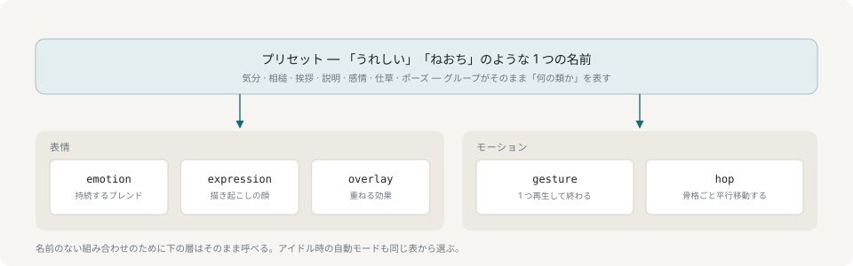

# プリセット

台詞に添えるものは、たいていは**プリセット**です。「うれしい」「ねおち」のように、表情とモーションをひと組の名前にしたものです。



その下の層が分かれているのには理由があります。感情は連続値で持続し、ジェスチャは離散的で終わり、跳躍は骨格全体を動かします。ただ、そのどれも呼び出し側が考える単位ではありません。「うれしい」と頼むのは 1 回の呼び出しですが、「joy 0.9 と cheer ジェスチャと 45mm の跳躍 3 回」は 4 回で、しかもそれは台本の顔をしたリグの話です。

## グループが「何の類か」を表す

気分（表情だけで、動かない。キャラクターを眺めている時間の大半は実際これです）、相槌、挨拶、説明、感情、仕草、そしてポーズ。ポーズは次に何か頼まれるまで保持されます。

エンジンの持つジェスチャはすべてどれかのプリセットに現れ、それを保証するテストがあります。表情の付いていないモーションは、いずれ自動モードが無表情のまま再生してしまうものだからです。

## プリセットはイベントではなく状態

新しく始めると前のものが終わります。ポーズは降り、上げた効果は下がり、伏せた瞼は戻ります。

例外は気分で、これだけは持続します。発話の感情が持続するのと同じ理由で、気分はそれを乗せた文とともに終わるものではないからです。

## 下の層はそのまま呼べる

プリセットに名前のない組み合わせのために、`emotion`・`expression`・`overlay`・`gesture`・`hop` はそれぞれ独立したコマンドとして残してあります。[コマンド](commands.md)を参照してください。

アイドル時の自動モードも同じ表から選ぶので、キャラクターが勝手にやることと頼めることは同じ語彙になります。`idle on` にしておけば、呼び出し側が何も送らなくても、発話の合間を自分で埋めます。

## このアバターが何を持っているか

`GET /api/vocabulary` が、いま立っているアバターが実際に持つプリセットをグループごとに返します。MCP 側では同じ id がツールのスキーマに入るので、モデルは一覧から選ぶだけになります。

```sh
yarn ctl vocab
```

## 次に読むもの

- [原稿と演出](lines-and-cues.md) — 1 行の途中でプリセットを変える
- [コマンド](commands.md) — 下の層
