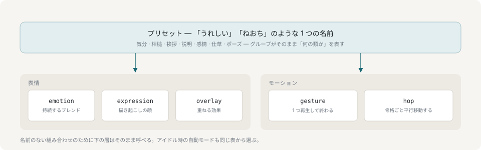

# プリセット

台詞に添えるものは、たいていは**プリセット**です。「うれしい」「ねおち」のように、表情とモーションをひと組の名前にしたものです。



その下の層は、振る舞いが違うので分けてあります。感情は連続値で持続し、ジェスチャは離散的で終わり、跳躍は骨格全体を動かします。ただ、そのどれも呼び出し側が考える単位ではありません。「うれしい」と頼むのは 1 回の呼び出しですが、「joy 0.9 と cheer ジェスチャと 45mm の跳躍 3 回」は 4 回になり、台本ではなくリグの話になります。

## グループ

基本のグループは、気分、相槌、挨拶、説明、感情、仕草、ポーズです。ポーズの動きは解除するまで保持されます。次のグループには、甘えたり、ふざけたり、カメラに向けて決めたりする短いモーションがあります。

| グループ | プリセット ID |
| --- | --- |
| 愛情 | `blowKiss`、`heartHands`、`heartOffer`、`selfHug`、`heartFlutter` |
| おちゃめ | `peekaboo`、`bunnyEars`、`fingerWag`、`pawBounce`、`shoulderShimmy` |
| アイドル | `doubleWave`、`idolPoint`、`spotlight`、`cuteSalute`、`stageBow` |
| 応援 | `fistPump`、`doublePump`、`rahRah`、`encourage`、`bravo` |
| ダンス | `sideSway`、`shoulderBounce`、`handRoll`、`discoPoint`、`tinyDance` |
| 撮影ポーズ | `flowerPose`、`cheekPeace`、`cheekPoints`、`faceFrame`、`modelTilt` |

この 6 グループのモーションは「撮影ポーズ」も含めて自動で終了します。表情の気分は、別の感情やプリセットで置き換えるまで続きます。各 ID は、表情付きのプリセットと、動きだけを再生するジェスチャの両方に使えます。

```sh
yarn ctl perform blowKiss
yarn ctl perform doubleWave
yarn ctl say "来てくれてありがとう！" --perform flowerPose
```

操作パネルと開発用コンソールでは、グループを選ぶとその中のプリセットが表示されます。日本語名・英語名・ID で全グループを横断検索でき、検索を消すと選択中のグループに戻ります。再生中のプリセットが別のグループにあっても「解除」は使えます。

台詞の `perform` フィールドや、`[heartHands]` のような文中のキューでも指定できます。

エンジンのすべてのジェスチャに対応するプリセットがあり、どのモーションも気分と組み合わせて指定できます。テストでこの対応を確認しています。

## プリセットは状態

新しく始めると前のものが終わります。ポーズは降り、上げた効果は下がり、伏せた瞼は戻ります。

例外は気分で、これだけは持続します。発話の感情が持続するのと同じ理由で、気分はそれを乗せた文とともに終わるものではないためです。

## 下の層はそのまま呼べる

プリセットに名前のない組み合わせのために、`emotion`・`expression`・`overlay`・`gesture`・`hop` はそれぞれ独立したコマンドとして残してあります。[コマンド](commands.md)を参照してください。

アイドル時の自動モードは、同じ表の中から選ばれたプリセットを使います。上記の 6 グループは明示的に選んだときに再生され、自動モードの候補には入りません。`idle on` にしておけば、呼び出し側が何も送らなくても、発話の合間を自分で埋めます。

## 常に動いているもの

その下でキャラクターは止まっていません。呼吸、片足からもう片足への重心の移り、スケジューラの引く瞬き、サッカードを伴う視線とそれに遅れて付いてくる頭、一拍遅れて追いつく髪と衣装。どれもコマンドではありませんし、呼び出し側を待ってもいません。

`idle` はその層のスイッチではなく、その上にある層です。切れば自分で演目を選ぶのをやめるだけで、呼吸は続きます。これらの数値に手が届くのは `tune` のほうで、切り替えではなくカーブごとのフェーダです。

## このアバターが何を持っているか

`GET /api/vocabulary` が、いま立っているアバターが実際に持つプリセットをグループごとに返します。MCP 側では同じ id がツールのスキーマに入るので、モデルは一覧から選ぶだけになります。

```sh
yarn ctl vocab
```

## 次に読むもの

- [原稿と演出](lines-and-cues.md) — 1 行の途中でプリセットを変える
- [コマンド](commands.md) — 下の層
