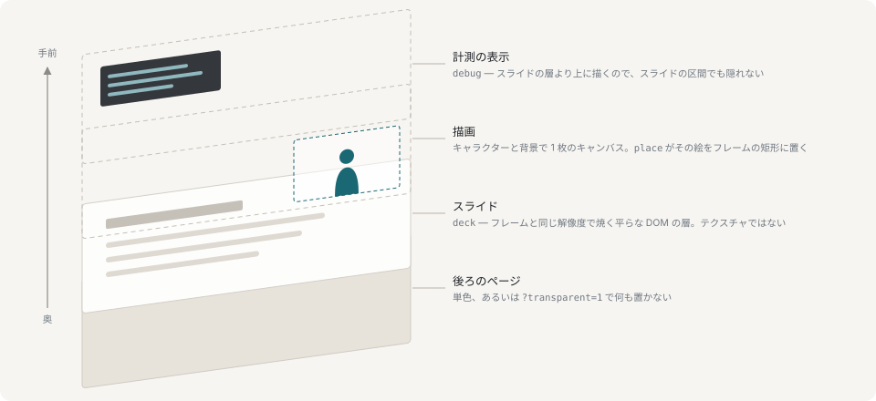

# スライド

キャラクターの後ろに PDF を出して、それを見ながら喋らせるためのものです。


これでブラウザソース 1 つ、OBS が受け取るのもこのままです。資料がフレーム全体を占め、キャラクターはその隅に置かれ、ページ送りは台詞に乗って届きます。



資料は平面です。部屋の中に置いた板でも、シーンのどこかのスクリーンに貼ったテクスチャでもなく、描画のすぐ背後に置いた DOM の層で、フレームと同じ解像度で焼いています。3D を通せば必ず起きることが、そのままスライドの文字が読めなくなる理由になります。トーンマッピングは白を動かし、フィルタリングは 1 ピクセル幅の線を鈍らせ、ページ送りは画像の差し替えではなくテクスチャの転送になります。平面にして失うのは傾けられることだけで、代わりに、ファイルと同じ精細さの文字が手に入ります。

## 出す

置き場所は `show/slides/` です。`--slides <dir>` でリポジトリの外を含めてどこへでも移せますし、どちらにしても git の管理外です。スライドの id は拡張子を除いたファイル名そのものです。

1 つだけ同梱してあります。`hashidate.pdf` は、このランタイムと作者についての 3 ページで、デモ台本がこれを出します。無視ルールの例外になっているのは `demo.yaml` と同じ理由で、配信ではなくプロジェクトのものだからです。

```sh
yarn ctl deck intro          # 1 ページ目で表示
yarn ctl slide               # 次へ
yarn ctl slide prev
yarn ctl slide 12
yarn ctl deck none           # 下ろす
```

スライドが出ている間、それは背景の場所を占めます。どちらもキャラクターの後ろだからで、レンダラはスライドが出ている間だけ部屋をしまい、下ろしたときにそのまま戻します。コマンドは 2 つのままなので、スライドへ行って戻ってくる区間が片道 1 コマンドで済み、どちらも相手の設定を言い直さずに済みます。

キャラクターは `place` でどきます。小さくなるのは絵であってショットではありません。[ステージ](stage.md#フレームのどこに立たせるか)を参照してください。

## ページ番号は行に載る

スライドをオペレータではなく台本に追従させるのはこの指定です。

```sh
yarn ctl say "まず全体像から。" --slide 2
yarn ctl say "これがその図です。" --deck hashidate --slide 1
```

ここに書けるのは絶対ページだけで、相対指定は**あえて**受け付けません。積んだ行は削除もでき、並べ替えもでき、もう一度送り直すこともできます。そこに「次のページ」と書いてあれば、台本に手を入れるたびに違うページを意味することになり、以降のスライドが丸ごと 1 つずれて、しかもキューのどこにも理由が残りません。

`slide` の相対指定は、矢印キーに手を置いて画面を見ながらめくるオペレータのためのものです。こちらは記述ではなく反応です。

## フォント

フォントを埋め込まずに名前で参照しているスライドは、pdf.js に同梱の文字マップと標準フォントの輪郭から描きます。日本語のスライドはたいていそうなっています。作った機械にそのフォントが入っていたためです。インストール済みパッケージの中身を `/pdfjs/` で配信しているのがそれにあたります。これがないと、そういうページは文字だけが消えた状態で描かれ、しかも何も報告されません。

## テキストとして読む

`GET /api/decks/<id>/text` は各ページの文字を返します。何も描画せずに取り出したものです。MCP 側にも同じものがツールとしてあります。

この機能の目的はそこにあります。スライドを読めるモデルは、そのスライドについての台本を書けて、各行にページ番号を振れます。

```sh
curl '127.0.0.1:8765/api/decks/intro/text?from=1&to=3'
```

## 次に読むもの

- [ステージ](stage.md) — スライドが押しのける背景
- [MCP アダプタ](mcp.md) — モデルからスライドを読む
